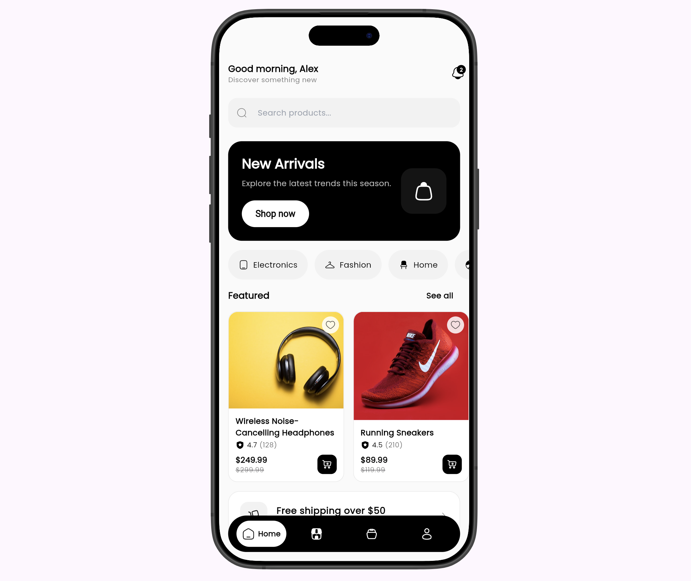

# Minimal Store

A modern, minimalist e-commerce mobile experience built with Flutter.

<p align="center">
  
</p>

<p align="center">
  <b>Clean UI • Smooth interactions • Complete shopping flows</b>
</p>

## Features

- **Home & Discovery** — Personalized greeting, prominent search entry, "New Arrivals" hero banner, scrollable category chips (Electronics, Fashion, Home, Sports, Books, Beauty), horizontal Featured rail, Popular grid, and free shipping promo strip.
- **Shop** — Full-screen product grid with live search, category filtering, and sorting (Featured, Price: Low→High, High→Low, Top Rated). Empty states handled gracefully.
- **Product Details** — Large image viewer, star ratings + review count, discounted pricing, size selector (S/M/L/XL), color swatches, full description, reviews summary bar, "You may also like" recommendations, favorite heart, and prominent Add to Cart action (respects stock).
- **Cart & Checkout** — Quantity stepper, swipe-to-delete or trash button, live subtotal/shipping/total (free shipping over $50), promo code field (demo), selectable shipping addresses & payment methods, "Place Order" that completes the flow.
- **Orders** — Order success screen, order history list, and detailed order view.
- **Account & Profile** — Profile header with stats (Orders, Favorites, Reviews), quick access to My Orders, Addresses, Payment Methods, Notifications, Settings. Logout returns to login.
- **Favorites** — Heart any product from detail or cards; dedicated screen with grid of saved items.
- **Search** — Dedicated search with recent searches history and real-time results.
- **Notifications** — Mock notification center with unread badge on home.
- **Onboarding** — Polished multi-page onboarding with skip/complete and persistence via SharedPreferences (skipped on subsequent launches).
- **Auth UI** — Login, Sign Up, and Forgot Password screens (visual flows only).

Everything is fully interactive with mock data — perfect for demos, portfolios, or as a starting point for a real store.

## Tech Stack

| Area              | Package / Choice                     |
|-------------------|--------------------------------------|
| Framework         | Flutter 3.12+                        |
| State Management  | Provider                             |
| Typography        | Google Fonts (Poppins)               |
| Icons             | Solar Icons                          |
| Images            | cached_network_image (Unsplash)      |
| Persistence       | shared_preferences                   |
| Dev Tooling       | device_preview (web framed previews) |

## Getting Started

```bash
# 1. Clone
git clone <repo-url>
cd modern_ecommerce

# 2. Install dependencies
flutter pub get

# 3. Run on a device or emulator
flutter run

# 4. (Optional) Run on web with beautiful device frames
flutter run -d chrome
```

> **Note**: Product images are loaded from Unsplash. An internet connection is required on first launch (they are then cached locally).

## Project Structure

```
lib/
├── main.dart                 # App entry, DevicePreview, root providers
├── router.dart               # Centralized named routing
├── theme.dart                # Light minimalist theme (black primary, rounded cards, etc.)
├── data/
│   ├── mock_data.dart        # 14 curated products + 6 categories
│   └── onboarding_data.dart
├── models/                   # Product, CartItem, Order, Category, etc.
├── providers/                # ProductProvider, CartProvider, BottomNavProvider
├── screens/                  # 20+ screens: home, shop, cart, checkout, profile, orders...
├── widgets/                  # ProductCard, CategoryChip, SearchBar, QuantitySelector...
└── services/                 # OnboardingService (persistence)
```

## Screenshots

The image at the top of this README shows the home experience (New Arrivals hero, categories, featured products). Tap through the bottom navigation to see Shop, Cart, and Profile in action.

Additional flows (product detail with variants, cart with summary, checkout, orders, favorites) are best experienced by running the app.

## Demo / Prototype Notes

- All data is local and mocked.
- "Place Order" succeeds immediately and clears the cart.
- Auth-related screens and some settings actions are UI-only.
- The elegant floating pill navigation stays visible and animates label + icon on selection.
- Designed and implemented with a strong focus on typography, spacing, micro-interactions, and mobile ergonomics.

## Contributing

Pull requests and feedback are welcome! If you're using this as a reference or base for your own project, a star or credit is appreciated.

---

**Minimal Store** — beautiful commerce UI, built fast with Flutter.
